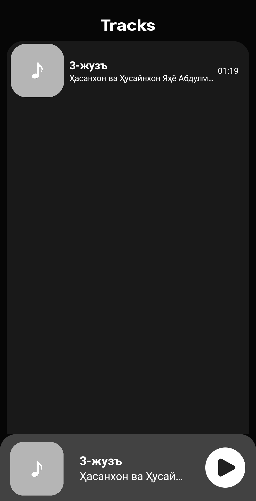
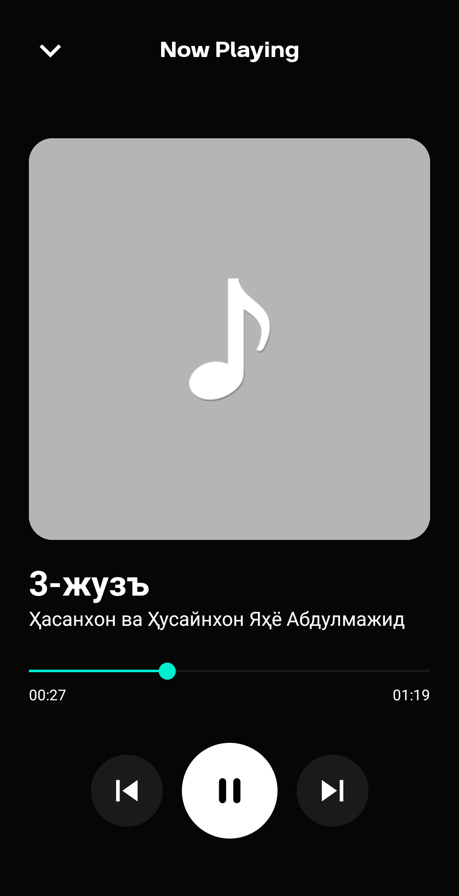

# Music Player

Music Player is an advanced Android application designed for playing music with a smooth user experience and powerful media capabilities.

## 🎵 Features

- **Play High-Quality Music** 🎶
- **Background Playback with Media Sessions** 🎛
- **Smooth Animations using Motion Layout** 🔄
- **Advanced Controls with ExoPlayer** 🎚
- **Manage Permissions Easily with Dexter** 📂

## 🛠 Technologies Used

- **Hilt** for Dependency Injection ⚙️
- **Media 3 & ExoPlayer** for Audio Playback 🎵
- **Media Sessions** for Background Control 🎛
- **Motion Layout** for UI Animations 🎭
- **Dexter** for Runtime Permission Management 🛑

## 📸 Screenshots

Below are some screenshots of the application:

<table>
  <tr>
    <td></td>
    <td></td>
  </tr>
</table>

## 🚀 Try the App

---

**Author: Imotdinov Bunyodbek**  
**Contact: [imotdinovbunyodbek2@gmail.com](mailto:imotdinovbunyodbek2@gmail.com)"
